# คู่มือการใช้งานระบบฝั่งแอดมิน

เอกสารนี้อธิบายการใช้งานฝั่งผู้ดูแลระบบตาม route และ view ที่มีอยู่จริงในโปรเจกต์ปัจจุบัน โดยอ้างอิง flow หลักภายใต้เมนู `/private/admin` และใช้ภาพ placeholder ชื่อ `test.png` แทนภาพหน้าจอจริงในทุกหัวข้อชั่วคราว

อ้างอิงโค้ดใน repository ณ วันที่ 15 เมษายน 2026

## ขอบเขตเอกสาร

- ครอบคลุมหน้าใช้งานฝั่งแอดมินที่มี route รองรับจริงใน `app/routes/frontend/private/admin/admin.routes.js`
- ใช้ชื่อ route จริงเพื่อให้ค้นหาหน้าในระบบและตรวจสอบกับ source code ได้ง่าย
- แยกคู่มือฝั่งแอดมินออกจากคู่มือผู้ใช้ทั่วไปอย่างชัดเจน
- ไม่รวมเมนู legacy หรือเมนูที่ไม่มี route ฝั่ง frontend แอดมินใช้งานจริงใน flow ปัจจุบัน เช่น English Channel, E-Learning, Contest และ Live Score
- รายการ `Path` ใต้หัวข้อรูปประกอบคือ path ของไฟล์ placeholder ที่จะถูกแทนด้วยภาพจริงในอนาคต

## หมายเหตุการ Capture ภาพหน้าจอ

ภาพหน้าจอในเอกสารฉบับนี้ยังไม่ใช่ภาพจริงจากระบบ และใช้ไฟล์ placeholder เดียวกันทุกหัวข้อก่อน:
- **Placeholder file**: `./assets/screenshots/admin/test.png`
- **สถานะรูปประกอบ**: `placeholder`
- **วันที่เตรียมเอกสาร**: 15 เมษายน 2026
- **สิทธิ์ที่ใช้เป็นฐานของ flow**: ผู้ใช้ที่มี role `admin`

เมื่อทีมกลับมา capture ภาพจริง ให้เปลี่ยนทั้งรูปประกอบ `Path`, `Description` และ `Status` ของแต่ละหัวข้อให้ตรงกับหน้าที่ใช้งานจริง

## 1. Dashboard และงานภาพรวม

### หน้า Dashboard แอดมิน
Route: `/private/admin`

วัตถุประสงค์  
ใช้เป็นหน้าหลักของผู้ดูแลระบบเพื่อเข้าไปยังเมนู Academic, Backoffice และงานตรวจทานที่เกี่ยวข้อง

สิทธิ์/เงื่อนไข  
ต้องเข้าสู่ระบบด้วยบัญชีที่มีสิทธิ์แอดมิน

ขั้นตอนใช้งาน  
1. เข้าสู่ระบบด้วยบัญชีแอดมิน  
2. เปิดหน้า `/private/admin`  
 
3. ตรวจสอบเมนูหลักที่ระบบแสดง เช่น Academic, Backoffice และงานที่ต้องติดตาม  
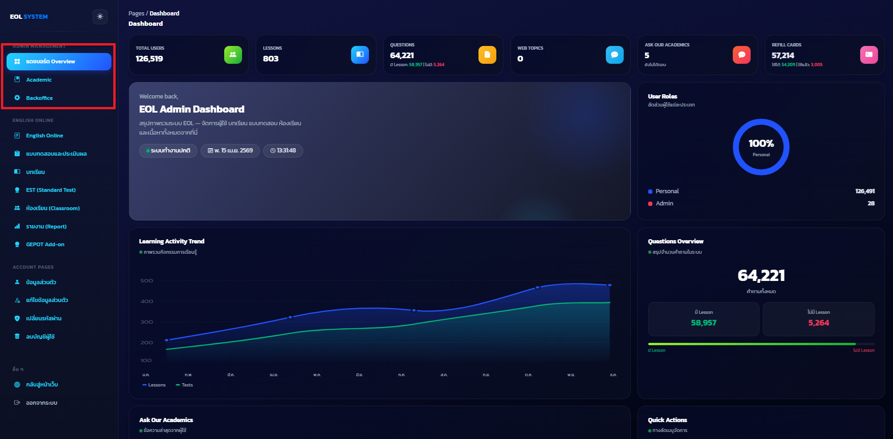 
4. เลือกเมนูที่ต้องการเพื่อเข้าสู่หน้าจัดการถัดไป

ผลลัพธ์ที่ควรเห็น  
หน้า dashboard ต้องแสดงการ์ดหรือเมนูหลักของงานแอดมินครบถ้วน และแต่ละรายการต้องกดเข้าไปยังหน้าที่เกี่ยวข้องได้

รูปประกอบ
 
Description: หน้า Dashboard แอดมินแสดงการ์ดเมนูหลักสำหรับเข้าจัดการ Academic, Backoffice และงานดูแลระบบ  
Status: `placeholder`

### รีวิว Ask Our Academic
Route: `/private/admin/ask-our-academic/review/:id`

วัตถุประสงค์  
ใช้เปิดดูและรีวิวรายการ Ask Our Academic รายคำถามจากฝั่งแอดมิน

สิทธิ์/เงื่อนไข  
ต้องมีสิทธิ์แอดมิน และมีรายการคำถามที่ต้องการเปิดตรวจ

ขั้นตอนใช้งาน  
1. เปิดหน้า `/private/admin/ask-our-academic/review/:id` ของรายการที่ต้องการ  

2. อ่านคำถามและรายละเอียดประกอบจากผู้ใช้  
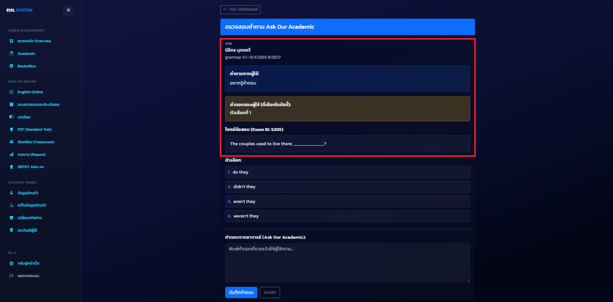
3. กรอกคำตอบในช่องข้อความ  
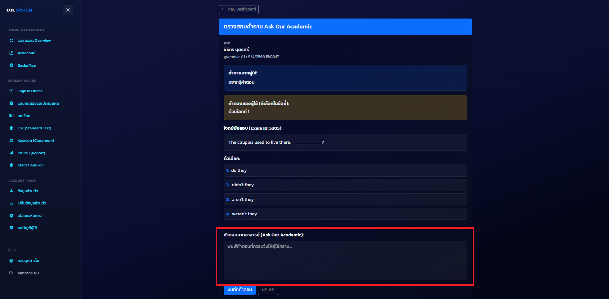
4. ดำเนินการตาม flow ที่หน้าเว็บรองรับ เช่น ตอบกลับ ปรับสถานะ หรือยกเลิกการทำรายการ
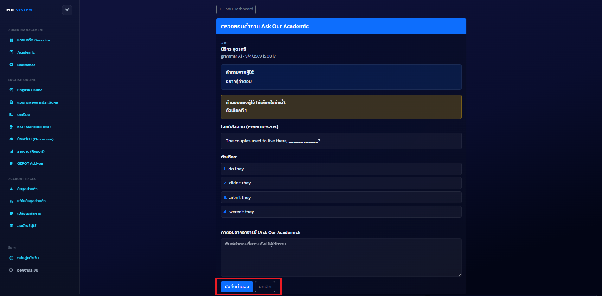

ผลลัพธ์ที่ควรเห็น  
หน้าต้องแสดงรายละเอียดของคำถาม Ask Our Academic ในระดับที่แอดมินใช้ตรวจสอบและจัดการต่อได้

รูปประกอบ
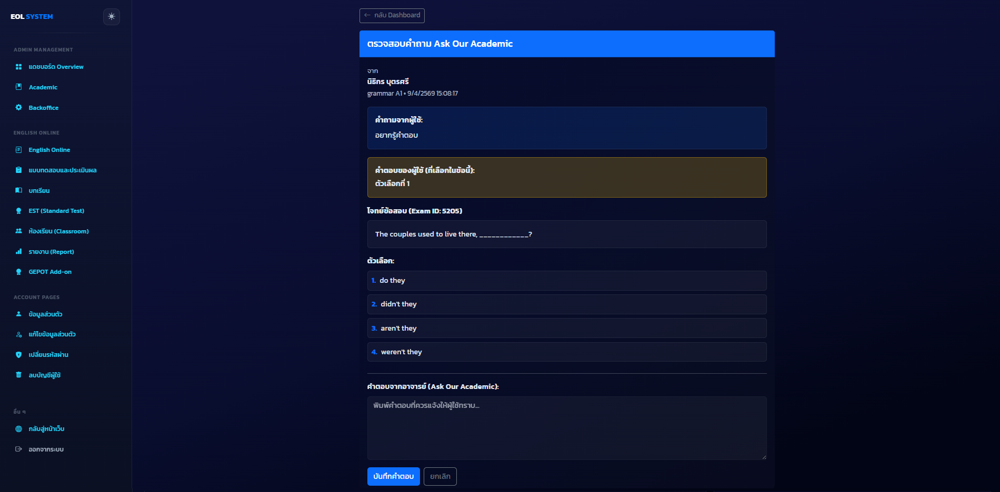  
Description: หน้ารีวิว Ask Our Academic ของแอดมิน แสดงคำถาม รายละเอียดผู้ส่ง และส่วนที่ใช้ตรวจทานหรืออัปเดตสถานะ  
Status: `placeholder`

## 2. Academic

### หน้า Academic Overview
Route: `/private/admin/academic`

วัตถุประสงค์  
ใช้เป็นหน้ารวมเมนูวิชาการของแอดมิน เช่น Lesson และ Question

สิทธิ์/เงื่อนไข  
ต้องมีสิทธิ์แอดมิน และเข้าถึงหมวด Academic ได้

ขั้นตอนใช้งาน  
1. เปิดหน้า `/private/admin/academic`  
 
2. ดูเมนูย่อยที่ระบบเปิดใช้งานจริงในหมวดวิชาการ  
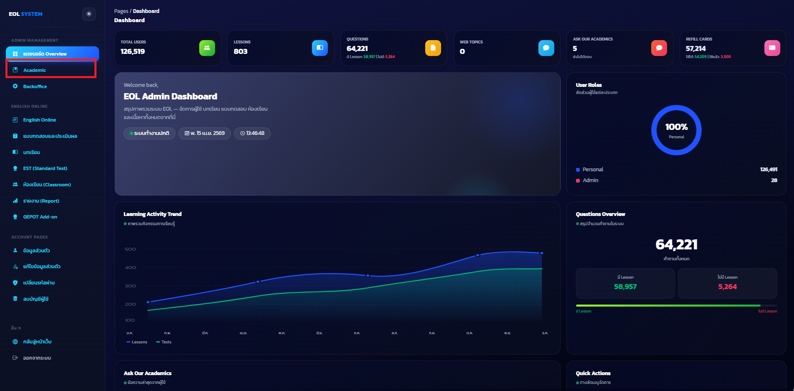 
3. เลือกไปจัดการ Lesson หรือ Question ตามงานที่ต้องการ
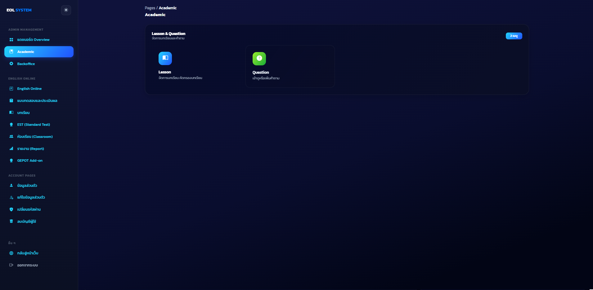 

ผลลัพธ์ที่ควรเห็น  
หน้าต้องแสดงเมนูวิชาการที่ใช้งานจริงในโปรเจกต์ปัจจุบัน โดยไม่ดึงเมนู legacy ที่ไม่มี route รองรับใน flow หลักเข้ามาปะปน

รูปประกอบ
 
Description: หน้า Academic Overview แสดงการ์ดเมนู Lesson และ Question ที่เป็นทางเข้าหลักของงานวิชาการ  
Status: `placeholder`

### จัดการบทเรียน
Route: `/private/admin/academic/lesson`

วัตถุประสงค์  
ใช้ดูรายการบทเรียนและเป็นจุดเริ่มต้นของการเพิ่มหรือแก้ไข lesson

สิทธิ์/เงื่อนไข  
ต้องมีสิทธิ์แอดมินด้านวิชาการ

ขั้นตอนใช้งาน  
1. เปิดหน้า `/private/admin/academic/lesson` 
  
2. ดูรายการบทเรียนที่มีในระบบ  
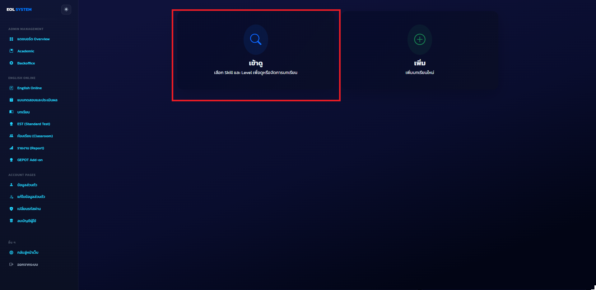  
3. เลือกเพิ่มบทเรียนใหม่หรือเปิดบทเรียนเดิมเพื่อแก้ไข  
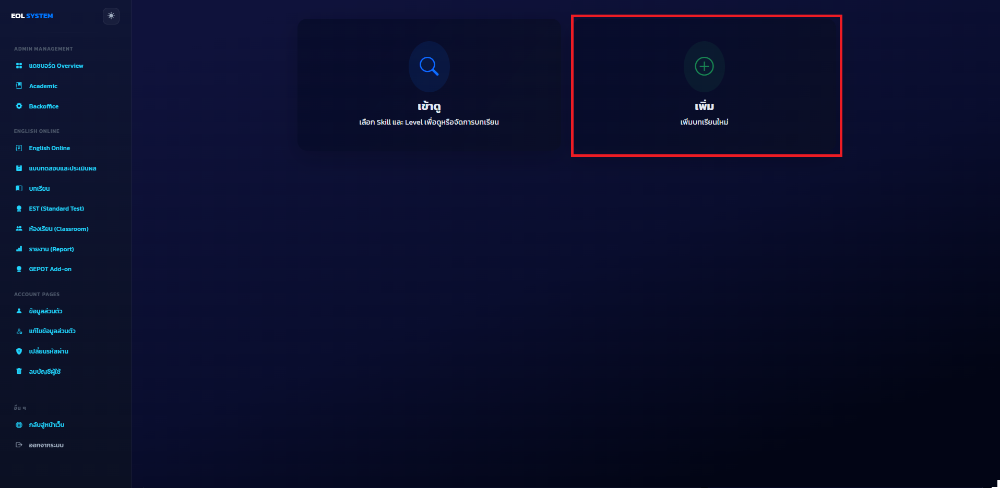  
4. ตรวจสอบว่ารายการที่แสดงสามารถใช้เป็นจุดเริ่มต้นของงานจัดการบทเรียนได้

ผลลัพธ์ที่ควรเห็น  
หน้าต้องแสดงรายการ lesson ในระบบพร้อม action หลักสำหรับเพิ่มและแก้ไข

รูปประกอบ
 
Description: หน้าจัดการบทเรียนของแอดมิน แสดงรายการ lesson และปุ่มไปเพิ่มหรือแก้ไขบทเรียน  
Status: `placeholder`

### เพิ่มบทเรียนใหม่
Route: `/private/admin/academic/lesson/add`

วัตถุประสงค์  
ใช้กรอกข้อมูลเพื่อสร้าง lesson ใหม่ในคลังวิชาการ

สิทธิ์/เงื่อนไข  
ต้องมีสิทธิ์แอดมิน และต้องการเพิ่มบทเรียนใหม่

ขั้นตอนใช้งาน  
1. เปิดหน้า `/private/admin/academic/lesson/add`  
  
2. กรอกข้อมูล lesson ตามฟอร์มที่ระบบกำหนด 
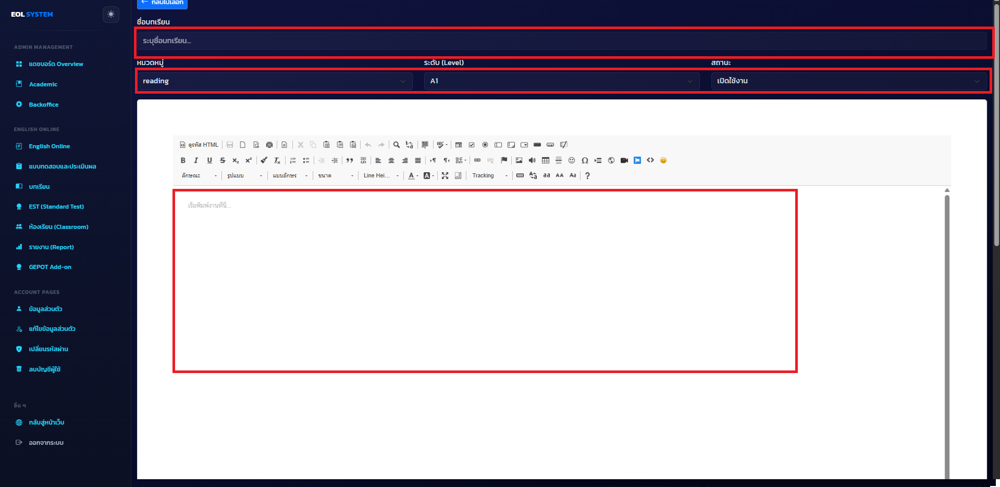  
3. ตรวจสอบความถูกต้องของข้อมูลก่อนบันทึก  
4. กดบันทึกเพื่อสร้างบทเรียนใหม่
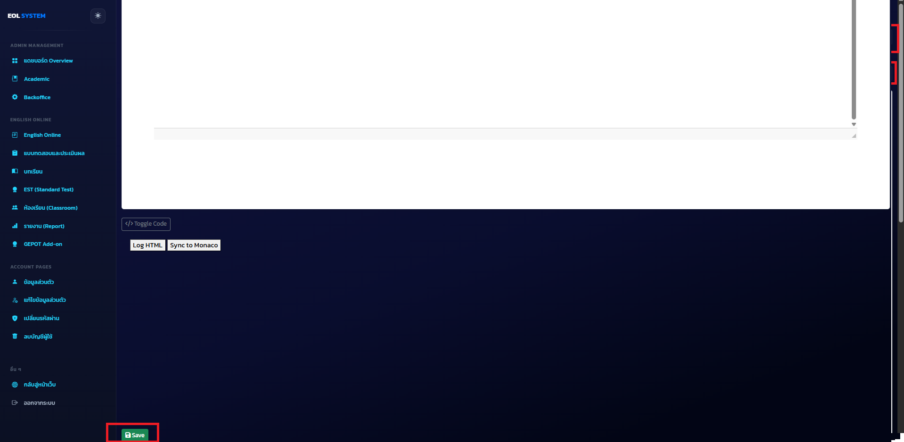  

ผลลัพธ์ที่ควรเห็น  
หน้าต้องแสดงฟอร์มเพิ่ม lesson อย่างครบถ้วนและรองรับการบันทึกข้อมูลใหม่ได้

รูปประกอบ
 
   
Description: หน้าเพิ่มบทเรียนใหม่ของแอดมิน แสดงฟอร์มข้อมูล lesson และปุ่มบันทึก  
Status: `placeholder`

### แก้ไขบทเรียน
Route: `/private/admin/academic/lesson/update-lesson`

วัตถุประสงค์  
ใช้แก้ไข lesson ที่มีอยู่แล้วในระบบ

สิทธิ์/เงื่อนไข  
ต้องมีสิทธิ์แอดมิน และมีบทเรียนที่เลือกมาแก้ไขแล้ว

ขั้นตอนใช้งาน  
1. เปิดหน้า `/private/admin/academic/lesson/update-lesson` จากรายการบทเรียน  
  
2. ตรวจสอบข้อมูลเดิมที่ระบบโหลดขึ้นมา 
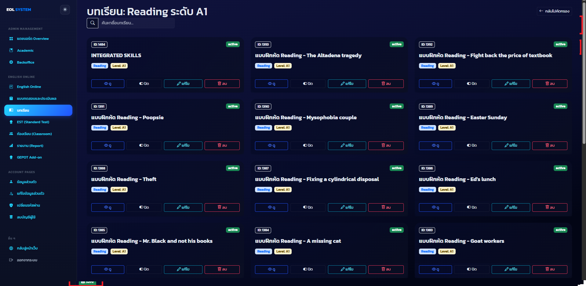   
3. แก้ไขข้อมูล lesson ตามที่ต้องการ  
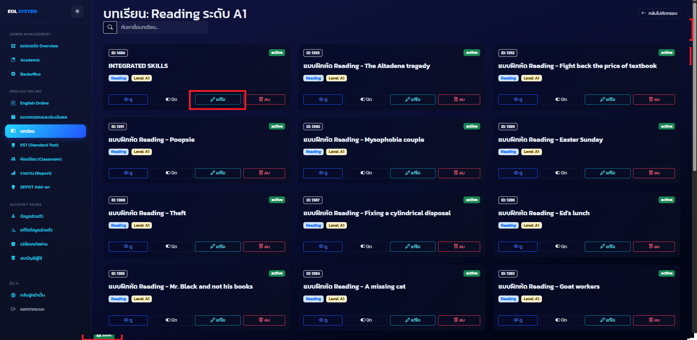  
4. บันทึกการเปลี่ยนแปลง
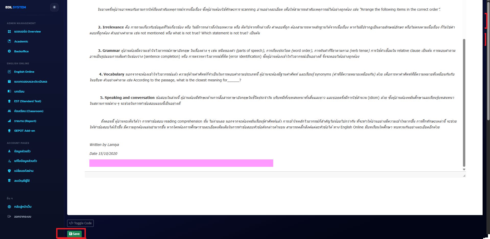  

ผลลัพธ์ที่ควรเห็น  
หน้าต้องโหลดข้อมูล lesson เดิมขึ้นมาให้แก้ไข และต้องบันทึกกลับได้เมื่อกรอกข้อมูลถูกต้อง

รูปประกอบ
 
    
Description: หน้าแก้ไขบทเรียนของแอดมิน แสดงข้อมูล lesson เดิมในฟอร์มและปุ่มบันทึกการเปลี่ยนแปลง  
Status: `placeholder`

### หน้า Question Overview
Route: `/private/admin/academic/question`

วัตถุประสงค์  
ใช้เป็นหน้าตั้งต้นของงานจัดการคลังข้อสอบ โดยแยกทางเข้าไปยังการดูรายการข้อสอบและการเพิ่มข้อสอบใหม่

สิทธิ์/เงื่อนไข  
ต้องมีสิทธิ์แอดมินด้านวิชาการ

ขั้นตอนใช้งาน  
1. เปิดหน้า `/private/admin/academic/question`  
   
2. ตรวจสอบตัวเลือกงานหลักที่ระบบแสดง  
3. เลือกว่าจะไปดูรายการข้อสอบหรือเพิ่มข้อสอบใหม่

ผลลัพธ์ที่ควรเห็น  
หน้าต้องแสดงทางเข้าหลักของงาน Question อย่างชัดเจน และนำไปยัง flow ถัดไปได้ถูกต้อง

รูปประกอบ
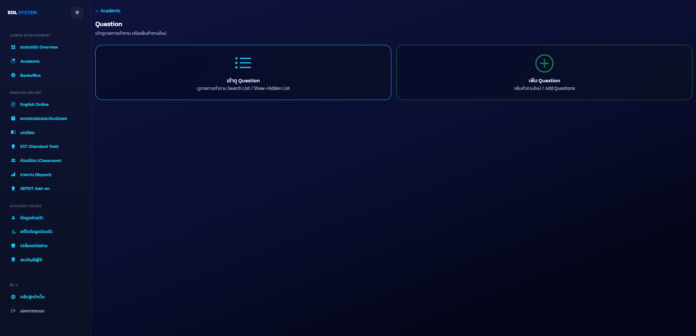   
Description: หน้า Question Overview แสดงการ์ดทางเข้าไปยังรายการข้อสอบและหน้าสำหรับเพิ่มข้อสอบใหม่  
Status: `placeholder`

### เลือก Skill เพื่อดูรายการข้อสอบ
Route: `/private/admin/academic/question/list`

วัตถุประสงค์  
ใช้เลือก skill เพื่อกรองรายการข้อสอบก่อนเข้าสู่หน้าระดับและรายการข้อสอบจริง

สิทธิ์/เงื่อนไข  
ต้องมีสิทธิ์แอดมิน และต้องการดูคลังข้อสอบตาม skill

ขั้นตอนใช้งาน  
1. เปิดหน้า `/private/admin/academic/question/list`  

2. ตรวจสอบรายการ skill ที่ระบบเปิดให้เลือก  

3. คลิก skill ที่ต้องการเพื่อไปยังหน้าระดับของ skill นั้น

ผลลัพธ์ที่ควรเห็น  
หน้าต้องแสดงรายการ skill สำหรับการค้นหาหรือจัดการข้อสอบอย่างครบถ้วน

รูปประกอบ

Description: หน้าเลือก Skill เพื่อดูรายการข้อสอบ แสดงตัวเลือกทักษะต่าง ๆ สำหรับเข้าสู่การกรองข้อสอบ  
Status: `placeholder`

### เลือกระดับเพื่อดูรายการข้อสอบ
Route: `/private/admin/academic/question/list/level?skill=...`

วัตถุประสงค์  
ใช้เลือกระดับของข้อสอบภายใน skill ที่เลือกไว้แล้ว

สิทธิ์/เงื่อนไข  
ต้องเลือก skill มาก่อนผ่าน flow รายการข้อสอบ

ขั้นตอนใช้งาน  
1. เปิดหน้า `/private/admin/academic/question/list/level?skill=...`  

2. ตรวจสอบ skill ที่กำลังใช้งานอยู่  

3. เลือกระดับที่ต้องการเพื่อเข้าสู่รายการข้อสอบจริง

ผลลัพธ์ที่ควรเห็น  
หน้าต้องแสดงระดับที่ใช้ได้สำหรับ skill ที่เลือก และสามารถพาไปยังรายการข้อสอบตาม skill กับ level ได้

รูปประกอบ
  
Description: หน้าเลือกระดับเพื่อดูรายการข้อสอบ แสดง level ที่สัมพันธ์กับ skill ที่เลือกไว้ก่อนหน้า  
Status: `placeholder`

### รายการข้อสอบตาม Skill และ Level
Route: `/private/admin/academic/question/list/:skill/level/:level`

วัตถุประสงค์  
ใช้ดูรายการข้อสอบที่ถูกกรองตาม skill และ level เพื่อค้นหา ตรวจสอบ หรือเปิดไปแก้ไขรายข้อ

สิทธิ์/เงื่อนไข  
ต้องเลือก skill และ level มาก่อน

ขั้นตอนใช้งาน  
1. เปิดหน้า `/private/admin/academic/question/list/:skill/level/:level` 
 
2. ตรวจสอบตัวกรองที่ระบบใช้กับรายการข้อสอบ 
  
3. ดูรายการข้อสอบที่แสดงในตารางหรือรายการ
   
4. เลือกข้อสอบที่ต้องการเปิดไปยังหน้ารายละเอียดหรือแก้ไข
 

ผลลัพธ์ที่ควรเห็น  
หน้าต้องแสดงข้อสอบที่ตรงกับ skill และ level ที่เลือก พร้อม action หลักสำหรับเปิดดูหรือแก้ไขข้อสอบ

รูปประกอบ
  
Description: หน้ารายการข้อสอบตาม Skill และ Level แสดงตารางข้อสอบ ตัวกรอง และปุ่มเปิดไปแก้ไขข้อสอบ  
Status: `placeholder`

### เลือก Skill เพื่อเพิ่มข้อสอบ
Route: `/private/admin/academic/question/add`

วัตถุประสงค์  
ใช้เลือก skill สำหรับ flow การเพิ่มข้อสอบใหม่

สิทธิ์/เงื่อนไข  
ต้องมีสิทธิ์แอดมิน และต้องการสร้างข้อสอบใหม่

ขั้นตอนใช้งาน  
1. เปิดหน้า `/private/admin/academic/question/add`  
  
2. ตรวจสอบรายการ skill ที่ระบบอนุญาตให้เพิ่มข้อสอบ  
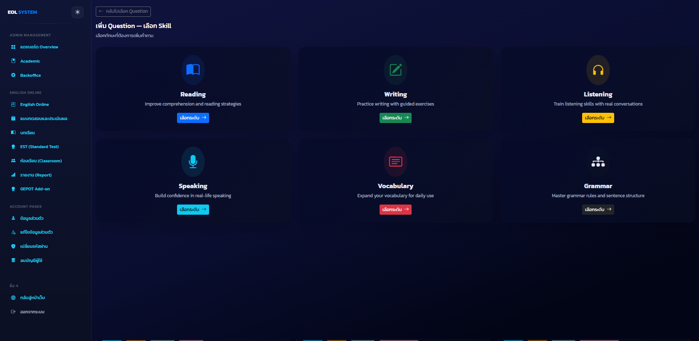  
3. เลือก skill ที่ต้องการเพื่อไปยังหน้าระดับ
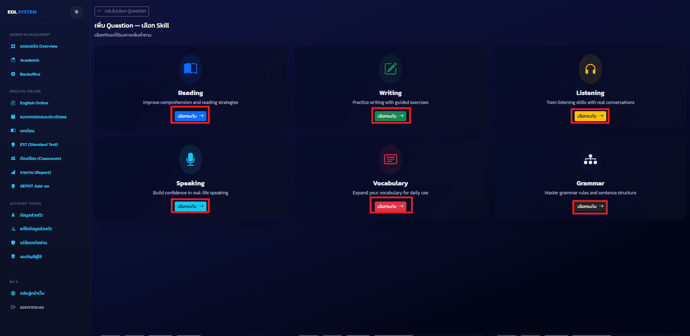  

ผลลัพธ์ที่ควรเห็น  
หน้าต้องแสดงรายการ skill สำหรับการสร้างข้อสอบใหม่ และแต่ละรายการต้องพาไปยังขั้นตอนเลือกระดับได้

รูปประกอบ
  
Description: หน้าเลือก Skill เพื่อเพิ่มข้อสอบ แสดงตัวเลือกทักษะก่อนเข้าสู่ขั้นตอนเลือกระดับและฟอร์มเพิ่มข้อสอบ  
Status: `placeholder`

### เลือกระดับเพื่อเพิ่มข้อสอบ
Route: `/private/admin/academic/question/add/level?skill=...`

วัตถุประสงค์  
ใช้เลือกระดับของข้อสอบใหม่ภายใน skill ที่ต้องการเพิ่ม

สิทธิ์/เงื่อนไข  
ต้องเลือก skill มาก่อนใน flow เพิ่มข้อสอบ

ขั้นตอนใช้งาน  
1. เปิดหน้า `/private/admin/academic/question/add/level?skill=...`  
2. ตรวจสอบ skill ที่กำลังจะเพิ่มข้อสอบ  
  
3. เลือกระดับที่ต้องการเพื่อเข้าสู่ฟอร์มเพิ่มข้อสอบ
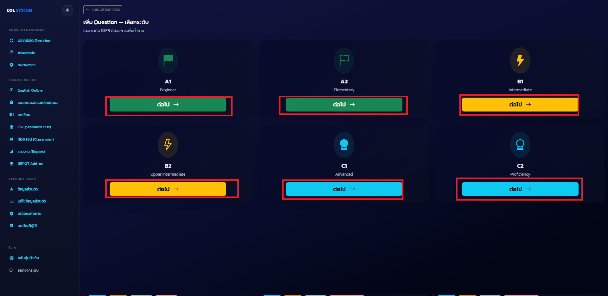  
ผลลัพธ์ที่ควรเห็น  
หน้าต้องแสดง level ที่ใช้ได้สำหรับ skill ที่เลือก และพาไปยังหน้าฟอร์มเพิ่มข้อสอบได้ถูกต้อง

รูปประกอบ
  
Description: หน้าเลือกระดับเพื่อเพิ่มข้อสอบ แสดงรายการ level ที่ใช้สร้างข้อสอบใหม่ใน skill ที่เลือกไว้  
Status: `placeholder`

### ฟอร์มเพิ่มข้อสอบ
Route: `/private/admin/academic/question/add/form?skill=...&level=...`

วัตถุประสงค์  
ใช้กรอกข้อมูลข้อสอบใหม่หลังจากเลือก skill และ level แล้ว

สิทธิ์/เงื่อนไข  
ต้องมีค่าของ skill และ level จาก flow เพิ่มข้อสอบ

ขั้นตอนใช้งาน  
1. เปิดหน้า `/private/admin/academic/question/add/form?skill=...&level=...`  
  
2. ตรวจสอบค่า skill และ level ที่ระบบแสดงในฟอร์ม  
  
3. กรอกข้อมูลโจทย์ ตัวเลือก คำตอบ และข้อมูลประกอบตามที่ระบบต้องการ  
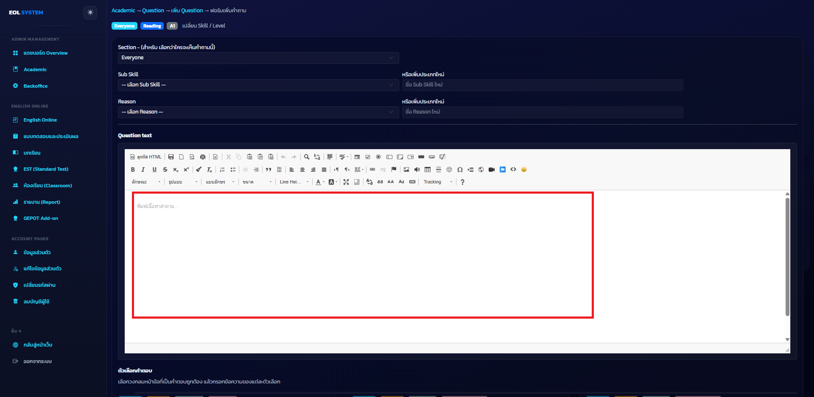  
4. บันทึกข้อสอบใหม่ และตรวจสอบผลลัพธ์หลังบันทึก
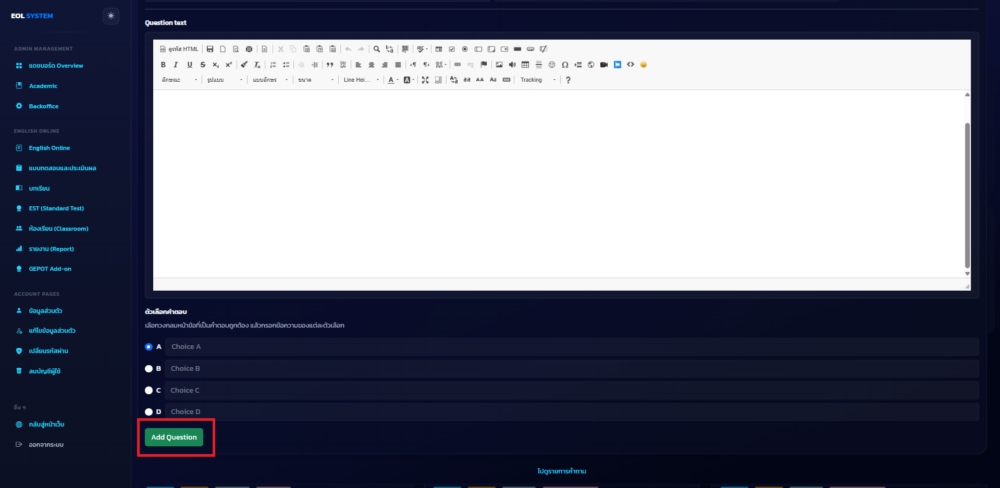  

ผลลัพธ์ที่ควรเห็น  
หน้าต้องแสดงฟอร์มเพิ่มข้อสอบอย่างครบถ้วน และหลังบันทึกแล้วต้องพาไปยัง flow ที่เกี่ยวข้องได้อย่างถูกต้อง

รูปประกอบ
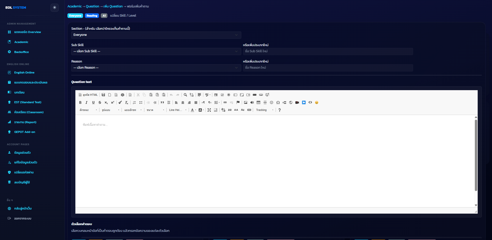  
  
Description: หน้าฟอร์มเพิ่มข้อสอบของแอดมิน แสดงช่องกรอกคำถาม ตัวเลือก คำตอบ และปุ่มบันทึกข้อมูล  
Status: `placeholder`

### แก้ไขข้อสอบ
Route: `/private/admin/academic/question/edit?questionId=...`

วัตถุประสงค์  
ใช้เปิดข้อสอบเดิมเพื่อแก้ไขข้อมูล เนื้อหา หรือโครงสร้างที่เกี่ยวข้อง

สิทธิ์/เงื่อนไข  
ต้องมี question id ที่ต้องการแก้ไข และมีสิทธิ์แอดมินด้านวิชาการ

ขั้นตอนใช้งาน  
1. เปิดหน้า `/private/admin/academic/question/edit?questionId=...`  
 
2. กดปุ่มแก้ไขในเอกสารที่ต้องการ  
 
3. แก้ไขข้อมูลตามที่ต้องการ  
 
4. บันทึกการเปลี่ยนแปลง และตรวจสอบผลลัพธ์หลังบันทึก
 

ผลลัพธ์ที่ควรเห็น  
หน้าต้องโหลดข้อมูลข้อสอบเดิมขึ้นมาให้แก้ไขได้ และมีปุ่มหรือ action สำหรับบันทึกการเปลี่ยนแปลงอย่างชัดเจน

รูปประกอบ
 \
  
Description: หน้าแก้ไขข้อสอบของแอดมิน แสดงข้อมูลข้อสอบเดิมใน editor และปุ่มบันทึกการเปลี่ยนแปลง  
Status: `placeholder`

## 3. Backoffice

### หน้า Backoffice Overview
Route: `/private/admin/backoffice`

วัตถุประสงค์  
ใช้เป็นหน้ารวมงานดูแลระบบหลังบ้าน เช่น ผู้ใช้ บัตรเติมเวลา และ GEPOT backoffice

สิทธิ์/เงื่อนไข  
ต้องมีสิทธิ์แอดมิน และเข้าถึงหมวด Backoffice ได้

ขั้นตอนใช้งาน  
1. เปิดหน้า `/private/admin/backoffice` 
  
2. ดูรายการเมนูหลังบ้านที่ระบบเปิดใช้งาน  
 
3. เลือกไปยังงานผู้ใช้ บัตรเติมเวลา หรือโมดูล GEPOT ตามภารกิจที่ต้องทำ

ผลลัพธ์ที่ควรเห็น  
หน้าต้องแสดงการ์ดทางเข้าแต่ละโมดูลของ Backoffice อย่างชัดเจน และแต่ละรายการต้องกดเข้าใช้งานได้

รูปประกอบ
  
Description: หน้า Backoffice Overview แสดงการ์ดเมนูผู้ใช้ บัตรเติมเวลา และเมนู GEPOT backoffice  
Status: `placeholder`

### รายการผู้ใช้
Route: `/private/admin/backoffice/users`

วัตถุประสงค์  
ใช้ดูรายชื่อผู้ใช้ทั้งหมดเพื่อค้นหาและเปิดดูรายละเอียดรายคน

สิทธิ์/เงื่อนไข  
ต้องมีสิทธิ์แอดมินด้านผู้ใช้

ขั้นตอนใช้งาน  
1. เปิดหน้า `/private/admin/backoffice/users`  
 
2. ใช้รายการ ตาราง หรือเครื่องมือค้นหาผู้ใช้  
 
3. เลือกผู้ใช้ที่ต้องการเพื่อเปิดหน้ารายละเอียดและตรวจสอบข้อมูลเบื้องต้นของแต่ละบัญชี
   

ผลลัพธ์ที่ควรเห็น  
หน้าต้องแสดงรายการผู้ใช้ในระบบพร้อมทางเข้าไปยังหน้ารายละเอียดรายคน

รูปประกอบ
 
    
Description: หน้ารายการผู้ใช้ของแอดมิน แสดงตารางผู้ใช้และ action สำหรับเปิดดูรายละเอียด  
Status: `placeholder`

### รายละเอียดผู้ใช้
Route: `/private/admin/backoffice/users/:id`

วัตถุประสงค์  
ใช้ดูและแก้ไขข้อมูลผู้ใช้ เช่น profile, role, corporate, วันใช้งานคงเหลือ และงาน reset password

สิทธิ์/เงื่อนไข  
ต้องมีสิทธิ์แอดมินด้านผู้ใช้ และมี user id ที่ต้องการเปิดดู

ขั้นตอนใช้งาน  
1. เปิดหน้า `/private/admin/backoffice/users/:id`  
    
2. ตรวจสอบข้อมูลบัญชีและโปรไฟล์ของผู้ใช้  
    
3. แก้ไขค่าที่ต้องการ เช่น บทบาท สิทธิ์ corporate หรือวันใช้งานคงเหลือ  
4. ใช้ flow reset password เมื่อต้องการสร้างรหัสผ่านใหม่  
    
5. บันทึกข้อมูลเมื่อแก้ไขเสร็จ
    

ผลลัพธ์ที่ควรเห็น  
หน้าต้องแสดงข้อมูลผู้ใช้แบบละเอียดและมีฟอร์มหรือ control สำหรับแก้ไขค่าหลักของบัญชีได้

รูปประกอบ
 
      
Description: หน้ารายละเอียดผู้ใช้ของแอดมิน แสดงข้อมูลบัญชี บทบาท วันใช้งานคงเหลือ และปุ่มหรือฟอร์มสำหรับแก้ไขกับรีเซ็ตรหัสผ่าน  
Status: `placeholder`

### จัดการบัตรเติมเวลา
Route: `/private/admin/backoffice/card`

วัตถุประสงค์  
ใช้สร้าง PIN และ Code สำหรับบัตรเติมวันใช้งาน พร้อมดูรายการบัตรที่มีอยู่ในระบบ

สิทธิ์/เงื่อนไข  
ต้องมีสิทธิ์แอดมินฝั่ง Backoffice

ขั้นตอนใช้งาน  
1. เปิดหน้า `/private/admin/backoffice/card` 
     
2. กรอกจำนวนวันต่อบัตรและจำนวนบัตรที่ต้องการสร้าง  
    
3. กดสร้าง PIN และ Code  
    
4. ตรวจสอบผลลัพธ์ที่ระบบสร้างให้  
    
5. ดูรายการบัตรทั้งหมด กรองข้อมูล หรือดาวน์โหลดการ์ดตามที่ระบบรองรับ

ผลลัพธ์ที่ควรเห็น  
หน้าต้องรองรับทั้งส่วนสร้างบัตร ส่วนแสดงผลลัพธ์การสร้าง และส่วนรายการบัตรทั้งหมดในหน้าเดียวกัน

รูปประกอบ
![หน้าจัดการบัตรเติมเวลา แสดงฟอร์มสร้าง PIN และ Code พร้อมพื้นที่แสดงรายการบัตรที่มีอยู่ในระบบ]!(/admin/card/printed.png)   
Description: หน้าจัดการบัตรเติมเวลา แสดงฟอร์มสร้าง PIN และ Code พร้อมพื้นที่แสดงรายการบัตรที่มีอยู่ในระบบ  
Status: `placeholder`

## 4. GEPOT Backoffice

### รายการชุดทดสอบ GEPOT
Route: `/private/admin/backoffice/gepot/tests`

วัตถุประสงค์  
ใช้ดูรายการ activity หรือชุดทดสอบ GEPOT ทั้งหมดในระบบ

สิทธิ์/เงื่อนไข  
ต้องมีสิทธิ์แอดมินที่เข้าถึง GEPOT backoffice

ขั้นตอนใช้งาน  
1. เปิดหน้า `/private/admin/backoffice/gepot/tests`  
 
2. ตรวจสอบรายการชุดทดสอบที่มีอยู่ในระบบ  
 
3. ใช้ปุ่มที่เกี่ยวข้องเพื่อเปิดรายละเอียด สร้างชุดทดสอบใหม่ หรือไปยังเมนู GEPOT อื่น
 

ผลลัพธ์ที่ควรเห็น  
หน้าต้องแสดงรายการชุดทดสอบ GEPOT พร้อม action หลักสำหรับดูรายละเอียดและสร้างชุดใหม่

รูปประกอบ
    
Description: หน้ารายการชุดทดสอบ GEPOT แสดงตารางหรือการ์ดของแต่ละ activity พร้อมปุ่มดูรายละเอียดและสร้างใหม่  
Status: `placeholder`

### สร้างชุดทดสอบ GEPOT ใหม่
Route: `/private/admin/backoffice/gepot/tests/new`

วัตถุประสงค์  
ใช้กำหนดข้อมูลเริ่มต้นของชุดทดสอบ GEPOT ใหม่

สิทธิ์/เงื่อนไข  
ต้องมีสิทธิ์แอดมิน และต้องการสร้าง activity ใหม่

ขั้นตอนใช้งาน  
1. เปิดหน้า `/private/admin/backoffice/gepot/tests/new`  
 
2. กรอกข้อมูลของชุดทดสอบ เช่น ชื่อ activity ช่วงเวลา หรือจำนวนข้อ  
 
3. ตรวจสอบความถูกต้องของข้อมูล  
4. บันทึกเพื่อสร้างชุดทดสอบใหม่
 

ผลลัพธ์ที่ควรเห็น  
หน้าต้องแสดงฟอร์มสร้างชุดทดสอบใหม่ และเมื่อบันทึกสำเร็จต้องนำไปยัง flow ถัดไปที่เกี่ยวข้องได้

รูปประกอบ

   
Description: หน้าสร้างชุดทดสอบ GEPOT ใหม่ แสดงฟอร์มชื่อ activity ช่วงเวลา จำนวนข้อ และปุ่มบันทึก  
Status: `placeholder`

### รายละเอียดชุดทดสอบ GEPOT
Route: `/private/admin/backoffice/gepot/tests/:id`

วัตถุประสงค์  
ใช้ดูและแก้ไขรายละเอียดของชุดทดสอบ GEPOT ที่สร้างไว้แล้ว

สิทธิ์/เงื่อนไข  
ต้องมี test id ที่ต้องการเปิดดู และมีสิทธิ์แอดมินที่เข้าถึง GEPOT backoffice

ขั้นตอนใช้งาน  
1. เปิดหน้า `/private/admin/backoffice/gepot/tests/:id`  
2. ตรวจสอบข้อมูลหลักของ activity ที่เลือก  
3. แก้ไขค่าที่ระบบรองรับ เช่น รายละเอียดชุดทดสอบหรือรายการคำถามที่ผูกไว้  
4. บันทึกหรือดำเนินการตาม action ที่หน้าเว็บรองรับ

ผลลัพธ์ที่ควรเห็น  
หน้าต้องแสดงข้อมูลของชุดทดสอบ GEPOT ในระดับที่แอดมินใช้ตรวจสอบและจัดการต่อได้

รูปประกอบ
  
Path: `./assets/screenshots/admin/test.png`  
Description: หน้ารายละเอียดชุดทดสอบ GEPOT แสดงข้อมูล activity ปัจจุบัน รายการคำถาม และส่วนจัดการค่าต่าง ๆ  
Status: `placeholder`

### คลังคำถาม GEPOT
Route: `/private/admin/backoffice/gepot/questions`

วัตถุประสงค์  
ใช้ดูคลังคำถามส่วนกลางที่เชื่อมกับงาน GEPOT และเปิดทางไปยัง flow แก้ไขข้อสอบ

สิทธิ์/เงื่อนไข  
ต้องมีสิทธิ์แอดมินที่เข้าถึง GEPOT backoffice

ขั้นตอนใช้งาน  
1. เปิดหน้า `/private/admin/backoffice/gepot/questions`  
2. ตรวจสอบรายการคำถามและตัวกรองที่หน้าเว็บรองรับ  
3. เลือกคำถามที่ต้องการเพื่อตรวจสอบหรือเปิดไปแก้ไข

ผลลัพธ์ที่ควรเห็น  
หน้าต้องแสดงรายการคำถามที่ใช้กับ GEPOT และมี action สำหรับเปิดไปยังหน้าจัดการข้อสอบได้

รูปประกอบ
  
Path: `./assets/screenshots/admin/test.png`  
Description: หน้าคลังคำถาม GEPOT แสดงรายการคำถาม ตัวกรอง และ action สำหรับเปิดไปแก้ไขคำถาม  
Status: `placeholder`

### จัดการ Code ของ GEPOT
Route: `/private/admin/backoffice/gepot/codes`

วัตถุประสงค์  
ใช้สร้าง จัดสรร ยกเลิก หรือดูสถานะการใช้งานของ code ที่เกี่ยวกับ GEPOT

สิทธิ์/เงื่อนไข  
ต้องมีสิทธิ์แอดมินที่เข้าถึง GEPOT backoffice

ขั้นตอนใช้งาน  
1. เปิดหน้า `/private/admin/backoffice/gepot/codes`  
2. ตรวจสอบรายการ code ที่มีอยู่ในระบบ  
3. ใช้ action ที่หน้าเว็บรองรับ เช่น generate, assign, unassign หรือ revoke  
4. ตรวจสอบผลลัพธ์หลังทำรายการ

ผลลัพธ์ที่ควรเห็น  
หน้าต้องแสดงตาราง code สถานะการใช้งาน และ action สำหรับจัดการ code ได้อย่างชัดเจน

รูปประกอบ
  
Path: `./assets/screenshots/admin/test.png`  
Description: หน้าจัดการ code ของ GEPOT แสดงตาราง code สถานะการใช้งาน และปุ่มสำหรับ generate หรือเปลี่ยนสถานะ  
Status: `placeholder`

### รายงาน GEPOT
Route: `/private/admin/backoffice/gepot/reports`

วัตถุประสงค์  
ใช้ดูผลสอบ GEPOT จากฝั่งแอดมิน เพื่อตรวจสอบผลลัพธ์ ดาวน์โหลดรายงาน หรือเปิดใบรับรองตามที่ระบบรองรับ

สิทธิ์/เงื่อนไข  
ต้องมีสิทธิ์แอดมินที่เข้าถึง GEPOT backoffice

ขั้นตอนใช้งาน  
1. เปิดหน้า `/private/admin/backoffice/gepot/reports`  
2. ใช้ตัวกรองที่หน้าเว็บรองรับเพื่อตรวจสอบผลสอบ  
3. ดูรายการผลสอบหรือคะแนนที่แสดง  
4. ใช้ action เพิ่มเติม เช่น export หรือเปิด certificate หากมีข้อมูลรองรับ

ผลลัพธ์ที่ควรเห็น  
หน้าต้องแสดงรายงาน GEPOT พร้อมตัวกรอง ผลลัพธ์ และ action ที่เกี่ยวข้องกับการส่งออกหรือเปิดเอกสารประกอบ

รูปประกอบ
  
Path: `./assets/screenshots/admin/test.png`  
Description: หน้ารายงาน GEPOT ของแอดมิน แสดงตัวกรองผลสอบ ตารางคะแนน และปุ่ม export หรือเปิด certificate  
Status: `placeholder`
