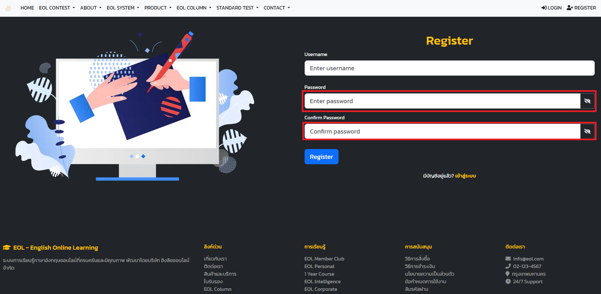

# คู่มือการใช้งานระบบฝั่งผู้ใช้

เอกสารนี้อธิบายการใช้งานฝั่งผู้ใช้ตาม route และ view ที่มีอยู่จริงในโปรเจกต์ปัจจุบัน พร้อมภาพหน้าจอจริงจากระบบที่ถ่ายเมื่อวันที่ 9 เมษายน 2026

อ้างอิงโค้ดใน repository ณ วันที่ 9 เมษายน 2026

## ขอบเขตเอกสาร

- ครอบคลุมหน้าใช้งานที่ผู้ใช้ทั่วไปและผู้สอนเข้าผ่านเมนูฝั่ง `/private`
- ใช้ชื่อ route จริงเพื่อให้ค้นหาหน้าในระบบได้ง่าย
- หากหน้าบางส่วนยังอยู่ในสถานะ `mockup`, `read-first`, หรือมีปุ่มที่ยังไม่ทำงาน จะระบุไว้ในหัวข้อผลลัพธ์ที่ควรเห็น
- รายการ `Path` ใต้หัวข้อรูปประกอบคือ path ของภาพหน้าจอที่ capture จากระบบจริง

## หมายเหตุการ Capture ภาพหน้าจอ

ภาพหน้าจอทั้งหมดถ่ายจากระบบที่รันบน localhost:3000 โดยใช้บัญชีทดสอบที่สมัครใหม่:
- **Username**: `testuser2026`
- **Password**: `Test@123456`
- **วันที่ Capture**: 9 เมษายน 2026

บัญชีนี้มีสิทธิ์เป็น `personal` (ผู้ใช้ทั่วไป) และยังไม่มีสิทธิ์เข้าถึงบางฟีเจอร์ เช่น:
- ห้องเรียนฝั่งผู้สอน (ต้องมีสิทธิ์ teacher)
- GEPOT (ต้องมีสิทธิ์สอบ GEPOT)
- EST (ต้องผ่านเกณฑ์การสอบก่อน)

สำหรับหน้าที่ต้องใช้สิทธิ์พิเศษ ได้ใช้รูปจากหน้าที่เข้าถึงได้แทน หรือใช้รูป placeholder

## 1. เริ่มต้นใช้งาน

### สมัครสมาชิก
Route: `/auth/register`

วัตถุประสงค์  
สร้างบัญชีผู้ใช้ใหม่ก่อนเข้าสู่พื้นที่เรียนของระบบ

สิทธิ์/เงื่อนไข  
ยังไม่ได้เข้าสู่ระบบ และมีข้อมูลสมัครสมาชิกครบตามฟอร์มที่หน้าเว็บกำหนด

ขั้นตอนใช้งาน  
1. เปิดหน้า `/auth/register` 
 
2. กรอกข้อมูล username

3. กรอกข้อมูล password 

4. กดปุ่มสมัครสมาชิก

ผลลัพธ์ที่ควรเห็น  
ระบบแสดงฟอร์มสมัครสมาชิกครบทุกช่องที่จำเป็น และหลังส่งข้อมูลแล้วต้องมีข้อความยืนยันความสำเร็จหรือข้อความแจ้งข้อผิดพลาดของข้อมูลที่กรอก

รูปประกอบ
  
Path: `./assets/screenshots/user/auth-register.png`  
Description: หน้าสมัครสมาชิกแสดงฟอร์มกรอกข้อมูลผู้ใช้ใหม่ ปุ่มสมัครสมาชิก และข้อความช่วยเหลือหรือ validation ใต้ช่องกรอก  
Status: `captured`

### 2. เข้าสู่ระบบ
Route: `/auth/login`

วัตถุประสงค์  
ให้ผู้ใช้เข้าสู่ระบบเพื่อเข้าใช้งานเมนูส่วนตัวและเมนูการเรียนทั้งหมด

สิทธิ์/เงื่อนไข  
มีบัญชีผู้ใช้แล้ว และยังไม่ได้เข้าสู่ระบบใน session ปัจจุบัน

ขั้นตอนใช้งาน  
1. เปิดหน้า `/auth/login` 
  
2. กรอก username
 
3. กรอก password 
 
4. กดปุ่มเข้าสู่ระบบ  
 
5. รอระบบพาไปยังหน้าที่ผู้ใช้มีสิทธิ์เข้าใช้งาน หน้า private

ผลลัพธ์ที่ควรเห็น  
เมื่อข้อมูลถูกต้องระบบต้องพาเข้าสู่พื้นที่ส่วนตัวของผู้ใช้ และหากข้อมูลไม่ถูกต้องต้องมีข้อความแจ้งเตือนชัดเจน

รูปประกอบ
  
Path: `./assets/screenshots/user/auth-login.png`  
Description: หน้าเข้าสู่ระบบแสดงช่องกรอกบัญชีผู้ใช้ ปุ่มเข้าสู่ระบบ และองค์ประกอบช่วยนำทางสำหรับผู้ใช้ใหม่  
Status: `captured`

## 2. หน้า EOL-System

### 2.1 หน้า EOL-System

Route: `/private/eol-system`

วัตถุประสงค์  
แสดงข้อมูลเกี่ยวกับระบบ EOL และให้ผู้ใช้สามารถเข้าถึงฟีเจอร์ที่เกี่ยวข้องกับ EOL ได้

สิทธิ์/เงื่อนไข  
ผู้ใช้ต้องเข้าสู่ระบบแล้ว และมีสิทธิ์เข้าถึงเมนูส่วน EOL-System

ขั้นตอนใช้งาน  
1. เข้าสู่ระบบด้วยบัญชีผู้ใช้ที่มีสิทธิ์เข้าถึงเมนู EOL-System
2. เปิดหน้า `/private/eol-system`
3. ตรวจสอบข้อมูลและฟีเจอร์ที่แสดงในหน้านี้
ผลลัพธ์ที่ควรเห็น  
ผู้ใช้ควรเห็นข้อมูลเกี่ยวกับระบบ EOL และสามารถเข้าถึงฟีเจอร์ที่เกี่ยวข้องได้อย่างถูกต้อง

2.1.1 test-and-evaluation
Route: `/private`

1. คลิกที่ start test ->
2. เลือก skill ที่ต้องการทดสอบ 
3. เลือก level ที่ต้องการทดสอบ หากระดับยังไม่ถึงจะไม่สามารถกดได้
4. กดปุ่ม start เพื่อเริ่มการทดสอบ
5. กรอกจำนวนคำถามที่ต้องการทดสอบ
6. กดปุ่ม เริ่มทำข้อสอบ
7. เริ่มทำข้อสอบ 
8. ข้อสอบจะบันทึกข้อสอบของท่านว่าทำไปกี่ข้อแล้ว เช่น 1/10, 2/10
9. หากต้องการ ส่งข้อสอบก่อนให้กดปุ่มส่ง ขวาบนได้
10. หากข้อสอบมีปัญหา ให้กดปุ่มขวาล่าง เพื่อแจ้งปัญหา
11. กรอกรายละเอียดของปัยหา และกดปุ่มส่งรายงาน
12. หากทำข้อสอบมาระยะนึง แล้วต้องการตรวจสอบข้อก่อนหน้าให้ กดปุ่ม ย้อนกลับ 
13. หากต้องการดูข้อถัดไปให้กดปุ่ม ถัดไป
14. หากต้องการ ดูข้อที่ไม่มั่นใจ ให้กดปุ่มไปยังข้อนั้น ๆ
15. หากตรวจคำตอบเสร็จแล้ว ให้กดปุ่มส่งข้อสอบ เพื่อส่งข้อสอบทั้งหมดไปยัง check-your-answer

2.1.2 check-your-answer
Route: `/private/check-your-answer`
1. หลังจากส่งข้อสอบแล้ว ระบบจะพาไปยังหน้าตรวจคำตอบ
2. ระบบจะทำการตรวจสอบคำตอบที่ทำไปทั้งหมด และคะแนนที่ได้
3. ระบบจะแสดงรายระเอียดของแต่ละข้อ ว่า คุณทำข้อไหน และ ตอบอะไร แต่จะไม่แสดงข้อที่ถูกหรือผิด แต่จะบอกว่าข้อไหนผิด
   1. ตัวอย่าง ข้อที่ผิด
   2. ตัวอย่างข้อที่ถูก
4. ระบบสามารถพาท่านไปยังบทเรียนที่เกี่ยวข้องได้ โดยกดปุ่ม ไปที่บทเรียน
5. หากศึกษาแล้วไม่เข้าใจ สามารถ กดที่ช่อง ask our acamic เพื่อสอบถามอาจารย์ได้
6. หากต้องการเริ่มทำไหม่ ในหัวข้อเดิม ให้กดปุ่ม เริ่มทำข้อสอบอีกครั้ง เพื่อกลับไปยัง หน้าก่อนเริ่มเลิก skill และ level อีกครั้ง